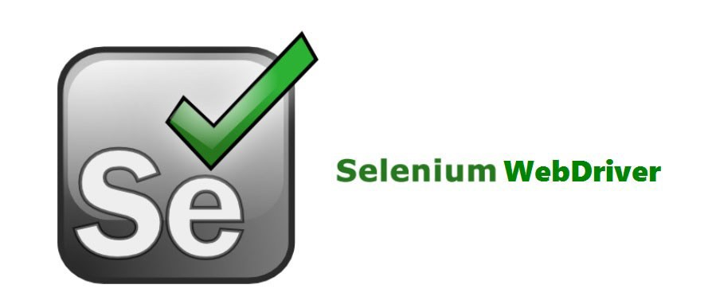

## Acceptance Testing For  [Saraswati Enterprises](https://saraswatienterprises.herokuapp.com/)

This testing is done with robot framework with custom testcases. Reports and Log has been generated automatically on each Test Case run.
Be sure to install Selenium Webdriver and required libraries mentioned in the requirements.txt file.

#### Test Cases Involved : -
1. Login Test Case
2. HomePage Test
3. Dashboard, Product Section and Bill Section all included in one Test Case

#### Tools used : -
* [Robot Framework](https://robotframework.org/)
* [Selenium Web Driver](https://www.selenium.dev/)

     Robot Framework       |  Selenium Web Driver
:-------------------------:|:-------------------------:
  |  
  
###### Last Updated : -
10 May 2021